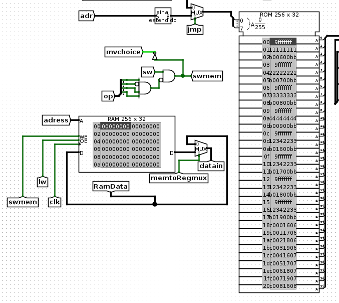

# Zazu MIPS-like processor
## ENTREGA TRABALHO DE ARQUITETURA E ORGANIZAÇÃO DE COMPUTADORES
Trabalho realizado por Thiago Nerton.
Este README fornece informações sobre a atribuição, como configurar e executar o projeto, e detalhes adicionais.

## Sumário
- [Main](#main)
- [ULA](#ULA)
- [RegCPU](#RegCPU)
- [UC](#UC)
- [Etc](#etc)
- [Contribuições](#contribuições)
- [Licença](#licença)

### Main
#### Visão Geral do Processador


Na imagem fornecida, observa-se o processador em sua totalidade, com todos os componentes visíveis. Esta imagem oferece uma visão geral dos elementos que compõem o processador.

#### Estrutura do Contandor de Endereço e Jump


A segunda imagem destaca o circuito responsável pelo controle do fluxo de instruções do processador, especificamente o contador de endereço e a lógica de salto (jump). Este circuito é crucial para iterar as instruções armazenadas na memória e para realizar desvios condicionais ou incondicionais no fluxo de execução do programa.


A terceira imagem mostra a parte do processador responsável pela manipulação de registradores e execução de operações. Esta parte recebe os códigos de operação (OPCODE) provenientes da memória e executa as ações correspondentes, como operações aritméticas, lógicas ou de transferência de dados. É onde ocorre a maior parte do processamento central do processador.
A integração dessas partes forma o processador como um todo, permitindo a execução de programas, manipulação de dados e realização de operações conforme as instruções fornecidas. A interação entre esses componentes é essencial para o funcionamento correto e eficiente do processador.



### UC


Foto do circuito responsável por interpretar os códigos de operação (OPCODEs) recebidos da memória e direcionar as operações apropriadas para os diferentes componentes do processador, como a ALU (Unidade Lógica e Aritmética), registradores, unidade de memória, entre outros. 

### ULA


Circuito responsável por realizar operações lógicas e aritméticas em dados que estão sendo processados pelo Zazu. A ULA é responsável por executar operações como Multiplicação de Matriz, adição, subtração, comparação, operações lógicas (como AND, OR, NOT) e operações de deslocamento (shift).

### Utilização

Projeto requer Logisim Evolution para ser executado.

### Etc
#### Ordem de Leitura
 - RT entry 1
 - RS entry 2
 - RD dest 
 - opcode
   
   V0 = Reg$3
   
   Escreve Um - Lê Dois
   
   Ordem    OP RD RT RS
   Manipulação de Endereço sempre por RD
   
#### OPCODES
  - 0000 : sll
  - 0001 : slr
  - 0010 : MUL
  - 0011 : ADD
  - 0100 : SUB
  - 0101 : AND
  - 0110 : OR
  - 0111 : XOR
  - 1000 : LES
  - 1001 : Li Turbo 
  - 1010 : JMP
  - 1011 : MOVE 
  - 1100 : MulMatrix4x4
  - 1101 : LI
  - 1110 : SW
  - 1111 : LW

### Multiplicação de Matrizes
O processador utiliza uma instrução especifica (Li Turbo) para lerdiretamente 32 bits da memoria e alocar no a0, depois esse valor e movido para a um registrador onde ocorrera a multiplicação de matrizes que serão guardades na memoria ram

#### Alterações no processador para suportar inserção de 32 bits


#### Instrução de Multiplicar Matrizes 


#### Exemplo de Multiplicação de Matriz
```
9FFFFFFF 11111111 b00600bb
9FFFFFFF 22222222 b00700bb
9FFFFFFF 33333333 b00800bb
9FFFFFFF 44444444 b00900bb

9FFFFFFF 12342233 b01600bb
9FFFFFFF 12342233 b01700bb
9FFFFFFF 12342233 b01800bb
9FFFFFFF 12342233 b01900bb

c0001606 c0011706 c0021806 c0031906
c0041607 c0051707 c0061807 c0071907
c0081608 c0091708 c00a1808 c00b1908
c0081609 c0091709 c00a1809 c00b1909
```
### Contribuições
 Thiago 100%

